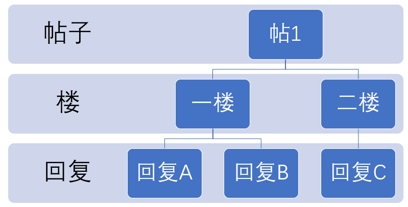
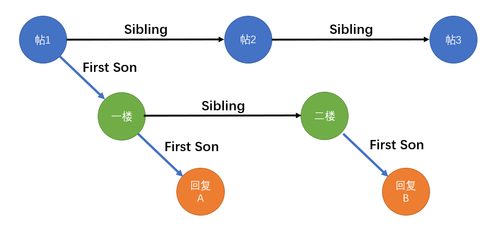

# P2P虚拟网络

P2P网络（peer-to-peer network）是一种区中心化的分布式网络，在P2P网络中，每个节点扮演着同样的角色，拥有同等的权利。相较于传统的“服务端-客户端”网络模型，P2P网络更加灵活，无需强劲的中心服务器，只需要多台终端设备就可以组成虚拟网络；但也因为其去中心，带来了稳定性、安全性的挑战。

P2P网络的拓扑结构独立于物理网络的结构。如同真实的网络中，在网络层，路由器需要进行路由与转发，才能将数据包跨越网络传递到目的地；而在P2P网络中，每个节点除了接收和发送自己的数据以外，还需要路由与转发网络上的数据包，才能使数据跨越网络，抵达彼此。

我们想要实现一个简单的P2P网络，使得它们能够进行报文通信。假设有三个节点ABC，且它们之间已经有socket连接`A-B-C`，我们想要使得任意节点发送的报文在整个网络都可以被收到。显然，A、C发出的报文是无法直接到达彼此的，必须要经过B的转发。而B在转发的时候也要考虑转发的对象，否则可能导致回环转发，进而引起广播风暴。

为了实现报文收发，我们设计了`peerhandler`模块，它是一组用于管理socket的线程。每一对监听、发送线程对应着一个peer。监听线程时刻侦听着来自peer的消息，发送线程在消息队列不为空的时候向peer发送消息。数据包的格式的如下

```python
{
    "source_name": 源主机名,
    "target_name": 目标主机名,
    "time": 发送时间,
    "content": 消息内容
}
```

在收到需要转发的数据时，会根据数据包中的`target name`与存储的peer列表进行对比，并且将数据包id与缓存中的id比对。若存在于`peer list`之中，且数据包id不存在于缓存之中，则继续进行转发。若数据包id在缓存之中，则表明最近转发过相同的数据包，于是不再转发，从而避免了广播风暴。`peer handler`运行效果如图所示。


# NAT打洞

NAT的作用是进行地址转换，它可以有效缓解IP地址有限的问题，并且可以提高网络的安全性，隐藏并保护网络内部的主机。然而，主机被隐藏也就意味着两台NAT后的主机并不知道对方的地址与端口号，也就无法直接建立TCP连接，这为P2P网络的构建带来了挑战。NAT打洞技术的目的就是在不改变NAT协议的基础上，穿过NAT，建立不同内网主机的直接通信。

假设有一个网络有如下拓扑结构。

```python
        s
       /|\
      / | \
   nat1 h0 nat2
    |       |
    h1      h2
```

它包含了一台直接连接到交换机的主机`h0`以及两台通过NAT连接到交换机的主机`h1`,`h2`。我们在mininet中模拟该网络，并尝试节点间相互`ping`。结果所有的节点均可以ping到`h0 nat1 nat2`；除了所连接的NAT，`h1 h2`均不可直接建立连接；NAT可以访问自己本地网络的节点以及Internet节点。这与NAT的特征相符合，在NAT子网中的主机没有独立的IP，因而无法直接访问；但是主机所发出的packet经过NAT的地址转换，可以被其他机器所接收，返回的响应再经过一次地址转换，就可以完成一次ping。


在基于UDP的打洞场景中，终端`h1`，`h2`分别与公网上的服务器`h0`建立UDP连接。当一个终端向服务器`h0`注册时，服务器`h0`记录下该终端的两对IP地址和端口信息，为描述方便，我们将一对IP地址和端口信息的组合称之为一个endpoint。一个endpoint是终端发起与服务器`h0`通信的IP地址和端口；另一个endpoint是服务器S观察到的该终端实际与自己通信所用的IP地址和端口。我们可以把前一个endpoint看作是终端的私网IP地址和私网端口；把后一个endpoint看作是终端的私网IP地址和端口经过NAT转换后的公网IP地址和公网端口。服务器`h0`可以从终端的注册报文中得到该终端的私网endpoint相关信息，可以通过对注册报文的源IP地址和UDP源端口字段获得该终端的公网endpoint。如果终端不是位于NAT设备后面，那么采用上述方法得到的两个endpoint应该是完全相同的。

当终端`h1`希望与终端`h2`建立连接时，UDP打洞过程如下所示：

1. 终端`h1`最初并不知道如何向`h2`发起连接，于是终端向服务器`h0`发送报文，请求服务器`h0`帮助建立与终端`h2`的UDP连接。

2. 服务器`h0`将含有终端`h2`的公网及私网的endpoint发给终端`h1`，同时，服务器`h0`将含有终端`h1`的公网及私网的endpoint的用于请求连接的报文也发给`h2`。一旦这些报文都顺利达到，终端`h1`与终端`h2`都知道了对方的公网和私网的endpoint。

3. 当终端`h1`收到服务器`h0`返回的包含终端`h2`的公网和私网的endpoint的报文后，终端`h1`开始分别向这些终端`h2`的endpoint发送UDP报文，并且终端`h1`会自动“锁定”第一个给出响应的终端`h2`的endpoint。此时，虽然`h1`发送的请求可能无法通过`nat2`，但是`nat1`记住了对应的endpoint，并建立了地址映射，允许来自`h2`的响应，此过程就被称为“打洞”。同理，当终端`h2`收到服务器`h0`发送的包含终端`h1`的公网和私网的endpoint的报文后，也会开始向终端`h1`的公网和私网的endpoint发送UDP报文，并且自动锁定第一个得到终端`h1`的回应的endpoint。由于终端`h1`与`h2`的互相向对方发送UDP报文的操作是异步的，所以终端`h1`与`h2`发送报文的时间先后没有严格的时序要求。

4. 在完成UDP打洞之后，两台终端可以进一步建立TCP连接等其他网络活动

服务器`h0`仅仅协助终端建立连接，在后续的通讯中并不参与数据转发；因为它具有记录活跃终端的作用，服务在P2P网络中常常被称作tracker。由于UDP转换协议提供的“洞”不是绝对可靠的，多数NAT设备内部都有一个UDP转换的空闲状态计时器，如果在一段时间内没有UDP数据通信，NAT设备会关掉由“打洞”操作打出来的“洞”，作为应用程序来讲如果想要做到与设备无关，就最好在穿越NAT后设定一个穿越的有效期。这个有效期与NAT设备内部的配置有关，目前没有标准有效期，最短的只有20秒左右。在这个有效期内，即使没有P2P数据报文需要传输，应用程序为了维持该“洞”可以正常工作，也必须向对方发送“打洞”维持报文。这个维持报文是需要双方应用都发送的，只有一方发送不会维持另一方的映射关系正常工作。

在mininet中的模拟结果如下：

# 信息安全机制

在中心化网络中，中心服务器是绝对的权威，一切数据的真伪皆由其存储的数据为裁定。然而在去中心化的P2P网络当中，同一个数据有着多个备份，且它们的地位均等，并不存在权威。由此便带来了伪造和篡改的风险。


为了保证P2P网络的数据安全，前人提出了数字签名与区块链。它们不依赖于权威来检验真伪，而是使用数学运算来验证真假。

## 数字签名

数字签名就如同现实中在合同上的签名一样，是一个人身份的证明，可以用来解决数据篡改问题。数字签名基于非对称密码，它需要两个密钥，一个是公开密钥，另一个是私有密钥；私钥用作加密，公钥则用作解密。由于私钥只由该用户自己持有，故可以肯定该文件必定出自于该用户；公众可以验证该用户发布的数据或文件是否完整、中途有否曾被篡改，接收者可信赖这些数据、文件确实来自于该用户。

数字签名的生成与验证过程如下：

1. 首先使用RSA、ECC等非对称加密算法生成一对公钥和私钥，私钥只有本人知道，而公钥是公开的
2. 对需要签名的数据使用摘要算法(如MD5，SHA)生成摘要值
3. 将摘要值使用私钥加密，并将加密值与公钥（或认证）一起保存，就生成了数字签名
4. 当接收方收到数据和数字签名后，使用公钥解密签名；将解密得到的值与数据的摘要值对比，如果一致，则证明签名者确实是本人；反之，则签名可能是伪造的

因为签名由摘要值得到，而不同数据的摘要值一般是不同的，所以数字签名无法套用到另一份数据上。如果没有私钥，就无法伪造签名。因此，私钥的安全性是数字签名可靠性的关键。

代码实例如下

```python
def generate_keypair():
    '''
    generate keypair with rsa.
    '''
    rsa = RSA.generate(2048)
    # 生成私钥
    private_key = rsa.exportKey()
    print(private_key.decode('utf-8'))
    # 生成公钥
    public_key = rsa.publickey().exportKey()
    print(public_key.decode('utf-8'))
    with open('rsa_private_key.pem', 'wb')as f:
        f.write(private_key)
    with open('rsa_public_key.pem', 'wb')as f:
        f.write(public_key)
    return private_key, public_key

def sign(private_key, data):
    '''
    generate signature of the data with private key.
    '''
    private_key = RSA.importKey(private_key)
    signer = PKCS1_signature.new(private_key)
    digest = SHA.new()
    digest.update(data.encode("utf8"))
    sign = signer.sign(digest)
    signature = base64.b64encode(sign)
    signature = signature.decode('utf-8')
    return signature

def check_sign(public_key, data, sign):
    public_key = RSA.importKey(public_key)
    verifier = PKCS1_signature.new(public_key)
    digest = SHA.new()
    digest.update(data.encode("utf8"))
    return verifier.verify(digest, base64.b64decode(sign))

if __name__ == '__main__':
    prv, pub = generate_keypair()
    msg = 'hello world!'
    fraud = '你好！'
    signature = sign(prv, msg)
    print(check_sign(pub, msg, signature))
    print(check_sign(pub, fraud, signature))
```

运行程序，真实的数据通过了认证，而伪造的数据被揭露。

## 区块链

区块链是一系列不断生长的记录，每一个记录就是一个区块。一个区块通常包含前一个区块的哈希值、时间戳和数据。因为每一个区块都包含前一个区块的信息，所以它们形成了一个链，每一个区块都为之前所有的区块作证。一旦区块链上的数据生成，要篡改是非常不易的，因为这影响到了后面所有的区块。

区块链技术常常被运用于分布式记账之中，但我们也可以将它运用于BBS论坛之中。我们定义一个数据包的结构如下：

```python
{ // 数据具体内容
    id: // 数据包id，使用SHA-256生成
    level: 1  // 1代表楼， 2代表帖，3代表评论，以此类推
    parent: // 父节点id
    content:  // 消息内容
    time:  // 发帖时间
    signature:  // 签名，包含发帖者的标识与验证信息
}
```

其中的id值使用哈希算法生成，也就对应了我们前面提到的区块哈希值。我们假设一下情景：

1. 区块的内容被篡改  则接受方收到后计算哈希值，比对区块id，就可以发现篡改
2. 区块的内容和id同时被篡改  因为id的变动，其后方的区块失去了父节点，从而发现了篡改。如果有两个区块指向了同一个父区块，则表明有冲突产生，之后选择保留有较多后续区块的一方。

由此可见，无论如何篡改一个区块，在区块链中都会影响到哈希值或是后继区块，从而暴露。然而，这个方法也存在一个缺点，那就是如果有人一直跟帖，就会导致被篡改区块的后继区块较长，从而真实节点被丢弃。为了解决这个问题，比特币等虚拟货币引入了算力验证机制，有足够算力才有记账权，除非篡改者拥有全网大部分算力，否则无法使得被篡改的链长于真实的链。若要完善我们的BBS，下一步也需要提出合适的工作验证机制。

代码实例如下：

```python
def generate_msg_id(msg):
    h = SHA256.new()
    h.update(msg.encode('utf8'))
    return h.hexdigest()

def check_msg_id(id, msg):
    h = generate_msg_id(msg)
    return h == id

if __name__ == '__main__':
    id = generate_msg_id(msg)
    print(check_msg_id(id, msg))
    print(check_msg_id(id, fraud))
```

# BBS论坛功能介绍及实现

## 功能介绍

## 消息树

BBS中的消息可以分为三类：帖、楼、回复。这三者是从属关系，一个帖子中有若干楼，一个楼下面有若干楼。它们可以构成一个森林。在计算机中存储森林最方便的形式是二叉树。每个节点包含三个地址引用，分别指向父节点(parent)，第一个子节点(first son)，以及兄弟节点(sibling)。





利用消息的`parent id`属性，可以构建起一颗二叉树。当需要浏览某一个帖子的内容时，只需要遍历它的`First son`子树即可。发帖、回复也就是向书中加入新的叶子。

## 消息收发

## 节点上线与下线
