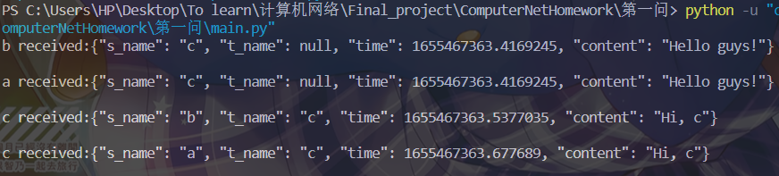
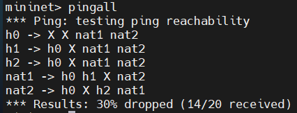

# P2P虚拟网络

P2P网络（peer-to-peer network）是一种去中心化的分布式网络，在P2P网络中，每个节点扮演着同样的角色，拥有同等的权利。相较于传统的“服务端-客户端”网络模型，P2P网络更加灵活，无需强劲的中心服务器，只需要多台终端设备就可以组成虚拟网络；但也因为其去中心，带来了稳定性、安全性的挑战。

P2P网络的拓扑结构独立于物理网络的结构。如同真实的网络中，在网络层，路由器需要进行路由与转发，才能将数据包跨越网络传递到目的地；而在P2P网络中，每个节点除了接收和发送自己的数据以外，还需要路由与转发网络上的数据包，才能使数据跨越网络，抵达彼此。

我们想要实现一个简单的P2P网络，使得它们能够进行报文通信。假设有三个节点ABC，且它们之间已经有socket连接`A-B-C`，我们想要使得任意节点发送的报文在整个网络都可以被收到。显然，A、C发出的报文是无法直接到达彼此的，必须要经过B的转发。而B在转发的时候也要考虑转发的对象，否则可能导致回环转发，进而引起广播风暴。

为了实现报文收发，我们设计了`peerhandler`模块，它是一组用于管理socket的线程。每一对监听、发送线程对应着一个peer。监听线程时刻侦听着来自peer的消息，发送线程在消息队列不为空的时候向peer发送消息。数据包的格式的如下

```python
{
    "source_name": 源主机名,
    "target_name": 目标主机名,
    "time": 发送时间,
    "content": 消息内容
}
```

在收到需要转发的数据时，会根据数据包中的`target name`与存储的peer列表进行对比，并且将数据包id与缓存中的id比对。若存在于`peer list`之中，且数据包id不存在于缓存之中，则继续进行转发。若数据包id在缓存之中，则表明最近转发过相同的数据包，于是不再转发，从而避免了广播风暴。`peer handler`运行效果如图所示。



# NAT打洞

NAT的作用是进行地址转换，它可以有效缓解IP地址有限的问题，并且可以提高网络的安全性，隐藏并保护网络内部的主机。然而，主机被隐藏也就意味着两台NAT后的主机并不知道对方的地址与端口号，也就无法直接建立TCP连接，这为P2P网络的构建带来了挑战。NAT打洞技术的目的就是在不改变NAT协议的基础上，穿过NAT，建立不同内网主机的直接通信。

假设有一个网络有如下拓扑结构。

```python
        s
       /|\
      / | \
   nat1 h0 nat2
    |       |
    h1      h2
```

它包含了一台直接连接到交换机的主机`h0`以及两台通过NAT连接到交换机的主机`h1`,`h2`。我们在mininet中模拟该网络，并尝试节点间相互`ping`。结果所有的节点均可以ping到`h0 nat1 nat2`；除了所连接的NAT，`h1 h2`均不可直接建立连接；NAT可以访问自己本地网络的节点以及Internet节点。这与NAT的特征相符合，在NAT子网中的主机没有独立的IP，因而无法直接访问；但是主机所发出的packet经过NAT的地址转换，可以被其他机器所接收，返回的响应再经过一次地址转换，就可以完成一次ping。



在基于UDP的打洞场景中，终端`h1`，`h2`分别与公网上的服务器`h0`建立UDP连接。当一个终端向服务器`h0`注册时，服务器`h0`记录下该终端的两对IP地址和端口信息，为描述方便，我们将一对IP地址和端口信息的组合称之为一个endpoint。一个endpoint是终端发起与服务器`h0`通信的IP地址和端口；另一个endpoint是服务器S观察到的该终端实际与自己通信所用的IP地址和端口。我们可以把前一个endpoint看作是终端的私网IP地址和私网端口；把后一个endpoint看作是终端的私网IP地址和端口经过NAT转换后的公网IP地址和公网端口。服务器`h0`可以从终端的注册报文中得到该终端的私网endpoint相关信息，可以通过对注册报文的源IP地址和UDP源端口字段获得该终端的公网endpoint。如果终端不是位于NAT设备后面，那么采用上述方法得到的两个endpoint应该是完全相同的。

当终端`h1`希望与终端`h2`建立连接时，UDP打洞过程如下所示：

1)终端`h1`最初并不知道如何向`h2`发起连接，于是终端向服务器`h0`发送报文，请求服务器`h0`帮助建立与终端`h2`的UDP连接。

2)服务器`h0`将含有终端`h2`的公网及私网的endpoint发给终端`h1`，同时，服务器`h0`将含有终端`h1`的公网及私网的endpoint的用于请求连接的报文也发给`h2`。一旦这些报文都顺利达到，终端`h1`与终端`h2`都知道了对方的公网和私网的endpoint。

3)当终端`h1`收到服务器`h0`返回的包含终端`h2`的公网和私网的endpoint的报文后，终端`h1`开始分别向这些终端`h2`的endpoint发送UDP报文，并且终端`h1`会自动“锁定”第一个给出响应的终端`h2`的endpoint。同理，当终端`h2`收到服务器`h0`发送的包含终端`h1`的公网和私网的endpoint的报文后，也会开始向终端`h1`的公网和私网的endpoint发送UDP报文，并且自动锁定第一个得到终端`h1`的回应的endpoint。由于终端`h1`与`h2`的互相向对方发送UDP报文的操作是异步的，所以终端`h1`与`h2`发送报文的时间先后没有严格的时序要求。

# 信息安全机制

# BBS论坛功能介绍及实现

## 功能介绍
### 操作说明
1. 先运行tracker.py
2. 主程序是 UI.py， 在运行 UI.py 前，修改如下变量为正确值
   |this_ip|this_port|tracker_ip|tracker_port|
   |:-:|:-:|:-:|:-:|
   |该客户的ip地址|该客户与tracker通信的端口（随意指定）|tracker的ip地址|tracker的端口（默认5000）|
### 发帖
输入标题和正文，点击发帖界面的“发布”按钮即可发帖。

该操作会将帖子广播到整个P2P网络中，接收到该消息的节点会将该节点加入到消息树中。

### 看帖
通过 `while` 循环持续刷新将接收到的新的消息呈现在树状目录中。通过点击节点在右侧上方的文本框中呈现对应消息详情。
### 回帖
在节点被选中的情况下在右侧下方的文本框中输入回复文字，再按下组合键`Ctrl+Enter` 将消息发送出去。


## 消息树

## 消息收发
### 消息结构
#### 请求历史消息的数据包
```json
{
    type: 'request'// 数据类型
    source: //包的发送者标识
    destination:  // 数据目标，不写表示广播
    time:  // 数据创建时间
    body:{ // 数据具体内容
        request_ids:  // 所需的数据ID，若不写表示所有
    }
}
```
`type` 字段固定为 "request"，用来与其他用途的数据包进行区别。只有新上线节点的邻居会收到该类型的数据包，因此该类型的数据包不会被广播，在收到该数据包后，节点应当逐个将自身存储的消息树中的节点发送至新节点 “source” 处。来帮助新节点同步历史消息。
#### 消息数据包
```json
{
    type: 'message'// 数据类型
    source: //包的发送者标识
    destination:  // 数据目标，不写表示广播
    time:  // 数据创建时间
    body:{ // 数据具体内容
        id: // 数据包id，使用SHA-256生成
        level: 1  // 1代表楼， 2代表帖，3代表评论，以此类推
        parent: // 父节点id
        content:  // 消息内容
        time:  // 发帖时间
        signature:  // 签名，包含发帖者的标识与验证信息
    }
}
```
这是在该P2P网络中最主要的数据包，因为只有该种 type 为 "message" 的数据包表示信息，并且会在网络中广播至每一个节点。消息树只会存储 "body" 字段之内的数据，而之外是数据是为了在P2P网络中进行传播与广播而进行的二次封装。而 "body" 字段之内的内容包括消息的文字部分（content）和消息的结构位置部分（id,level,parent）。
#### 退出数据包
```json
{
    type: 'quit'// 数据类型
    ip://自己的ip地址
    ports:[...]//自己所有的监听端口号
    time:  // 数据创建时间
}
```
该种数据包 type 为 "quit"，表示的含义是发出该数据包的节点将要下线，通知其邻居节点在其邻居列表当中将自己删除。而下线时与 tracker 的通信和该数据包无关，节点将单独与 tracker 直接通信。
其中的 ports 字段表示自身的所有监听端口号，用于帮助邻居节点找到对应于该节点的发送与接收线程，便于停止与删除操作。
### 消息接收
通过P2P网络的实现，在这基础之上，可以实现信息的广播。对于接收线程收到的消息，输入到输入队列中，并将其逐个出队并加入到消息树当中。同时也展示在前端。
### 消息发送
对信息进行广播，来实现对P2P网络中所有节点的消息更新。将包装好的信息（以json字符串形式）推入到发送队列当中等待发送线程将其传递给其所有邻居节点。
### 消息中转
为了实现消息的广播，指定策略：节点必须转发其收到的包，除非该包之前已经在该节点进行过一次转发。为了判断是否收到过包，储存包的哈希值以进行比对。
## 节点上线与下线
### tracker
tracker 起到的作用是储存当前存活的节点地址，并在新节点上线时告诉新节点其他节点的地址。具体流程如下：
1. 新节点上线，将自身地址与可用端口号告诉tracker
2. tracker根据记录的存活节点，引导新节点与存活节点之间建立对等的连接。

### 节点上线
在节点上线时，首先要联络tracker，来和其他的存活节点建立对等连接。在建立连接后，要向其邻居节点请求历史消息树，将以往的节点逐个接收并插入到自己的消息树中，来达到更新数据的作用。
### 节点下线
节点下线时，首先要向tracker通信告知自己的下线，在tracker的存活节点记录中删除。同时向自己的邻居发送quit信息，在邻居的邻居节点列表中删除自身。